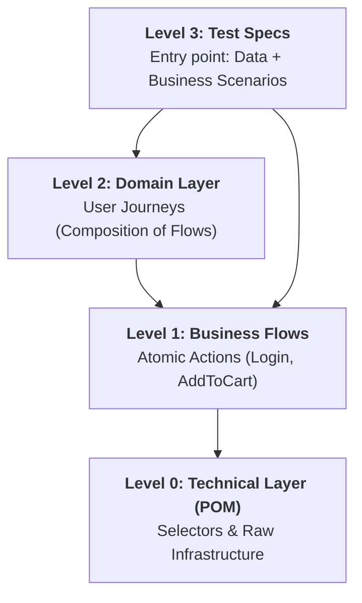
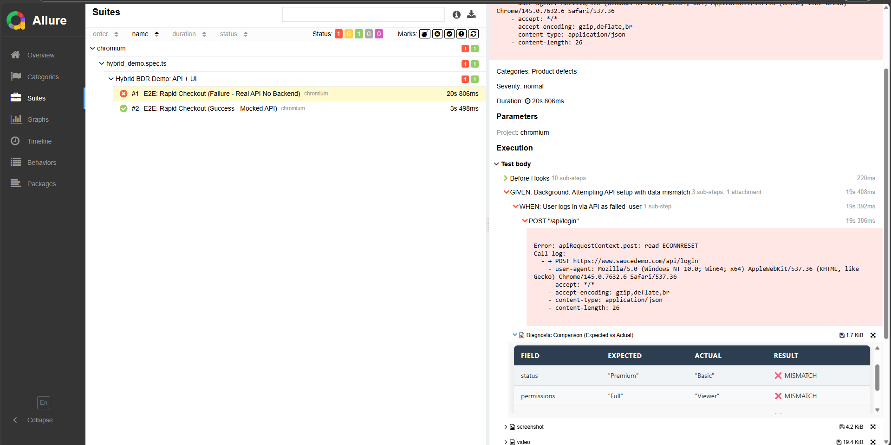
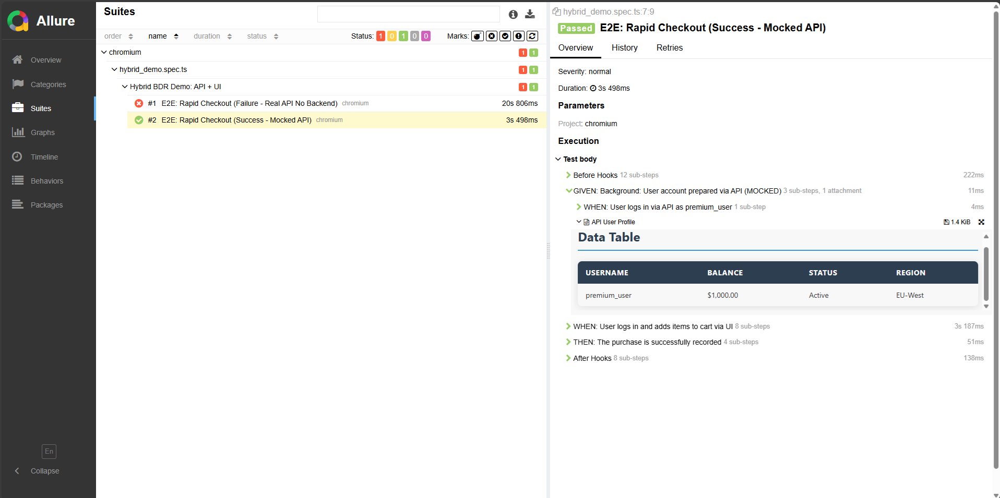

# BDR Methodology: Business-Driven Living Requiments

> **"Minimum Magic, Maximum Control"** — The engineering standard for scaling test automation to 1000+ tests.

BDR is a **universal architectural contract** between your code and your reporting. While this repository provides a reference implementation in Playwright and TypeScript, BDR is framework-agnostic and designed to be portable across Any stack (Python, Java, Go, etc.).

---

## Universal 4-Layer Architecture (Bottom-Up)

BDR enforces a strict hierarchy to ensure that as your project grows, your maintenance costs stay linear.



### Responsibility Matrix

| Layer | Type | Responsibility | Pseudocode Example (Universal) |
| :--- | :--- | :--- | :--- |
| **Level 3** | **Spec** | Verification logic & Data injection. | `verify_purchase(user, "Laptop")` |
| **Level 2** | **Domain** | Composition of multiple Flows. | `buy_item = [login, add_to_cart, pay]` |
| **Level 1** | **Flow** | High-level action within a module. | `step("Login") { auth.perform() }` |
| **Level 0** | **Technical** | Selectors, API Clients, DB Queries. | `page.locator("#submit").click()` |

---

## Stability Rules (The Anti-Flakiness Manifesto)

Scaling fails not because of "bad tools", but because of "bad discipline". BDR mandates these rules:

1. **Isolation by Contract:** A Flow at Level 1 must never know about another Flow's internal state. Communication only happens via arguments.
2. **Infrastructure Guards:** Use a **Global Suite Setup** (e.g., JUnit `@BeforeAll`, Pytest session fixtures, Playwright `globalSetup`) to verify DB/API health *before* starting the runner. If the environment is down, fail the whole run in 1 second.
3. **Implicit vs Explicit:** No "hidden" waits in Flows. All synchronization (waits for element/state) happens strictly at **Level 0 (Technical)**.
4. **Diagnostic Integrity:** Every business-critical check must attach a **Comparison Table** or Data-Snapshot to the report. Video is the detective; Tables are the spoiler.
    


---

## Scaling Patterns for 1000+ Tests

### 1. Lazy Proxy / DI initialization
Avoid "Fixture Hell" where every test worker initializes 100+ objects. Use lazy initialization to instantiate objects only when the test execution reaches that specific layer.

```text
// Pattern: Lazy Creation
if flow_not_initialized:
    flow = create_new_instance()
return flow
```

```typescript
// Reference Implementation (Playwright Fixture)
export const test = base.extend({
    loginFlow: async ({ page }, use) => {
        await use(new LoginFlow(new LoginPage(page))); // Created on demand
    }
});
```

```go
// Go Example: BDR Contract via Explicit Wrappers
func (f *LoginFlow) Login(user User) {
    bdr.Step("Login as "+user.Name, func() {
        f.LoginPage.Open()
        f.LoginPage.Fill(user)
    })
}
```

### 2. Hybrid API+UI Orchestration
Prepare data via API (Fast/Stable) and verify behavior via UI (Realistic). BDR unifies these into one report:
- `[API] Create User "Alex"` (300ms)
- `[UI] Login as "Alex"` (2s)
- `[UI] Verify Dashboard` (1s)



---

## Porting to Other Stacks

BDR is a mindset. Here is how you implement the "Step Bridge" in other ecosystems:

| Stack |  Bridge | Implementation Pattern |
| :--- | :--- | :--- |
| **Python** | `allure.step` | Decorators on Flow-class methods. |
| **Java** | `@Step` (Allure/JUnit) | Annotated methods in Business-logic classes. |
| **Go** | `allure-go / BDR.Step` | Functional wrappers around Flow actions. |
| **Robot** | `Library Keywords` | Grouping keywords into Domain/Flow resources. |

---

## Team Methodology

- **Automation Engineer:** Architect of Level 0-2. Focus on stability and dry code.
- **Manual QA / Domain Expert:** Quality Censor. Reviews Allure reports as "living documentation". If a report is unreadable or technical jargon leaks in — it's a bug in the Flow layer.
- **Developer:** Can contribute to Level 0 (Infrastructure) or Level 1 (Flows) during feature development.

---

## Reference Implementation (This Repo)
- **Playwright + TypeScript + Allure**
- Core BDR utilities found in `src/bdr/`.
- Demo scenarios in `tests/scaling_demo.spec.ts`.

---
*BDR is the bridge between Engineering Excellence and Business Transparency.*
