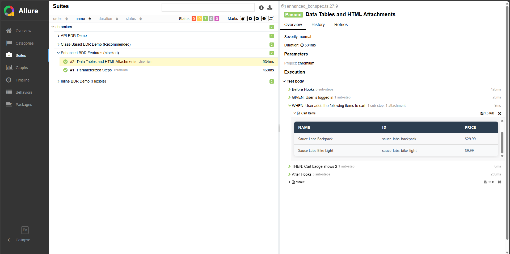

# Business-Driven Reporting (BDR) 

**Business-Driven Reporting (BDR)** is a methodology that brings the clarity of BDD (Gherkin) to the robustness of Code-First automation.


*Example of a BDR report: Clear business steps with data tables, generated directly from code.*

## The BDR Manifesto

We believe that test automation bridges the gap between Business and Engineering.

*   **Living Documentation** over Static Text Files (.feature).
    *   *The code itself should be the single source of truth. No more syncing Gherkin with Step Definitions.*
*   **Type Safety** over Regular Expressions.
    *   *Strictly typed steps prevent rot better than loose string matching.*
*   **Business Semantics** over Technical Implementation.
    *   *`User completes checkout` is better than `Click Pay Button`.*
*   **Unified Workflow** over Context Switching.
    *   *Engineers should live in the IDE, not switch between Gherkin features and code.*

## Quick Start with Playwright & TypeScript

*(This section describes the specific implementation of this template)*

### Prerequisites
- **Node.js** (v14+)
- **Java Development Kit (JDK 8+)** (Required for Allure Report generation)

### Setup & Run
1.  **Clone the repository**:
    ```bash
    git clone https://github.com/dmitryAQA/playwright-bdr-template.git
    cd playwright-bdr-template
    ```

2.  **Install dependencies & browsers**:
    ```bash
    npm install
    npx playwright install
    ```

3.  **Run tests**:
    ```bash
    npm test
    ```

4.  **View "Living Documentation"**:
    ```bash
    npm run report
    ```

## Project Structure

To use BDR in your own project, you only need the `src/bdr` directory. The rest of this repository serves as a template and demonstration.

```text
playwright-bdr-template/
├── src/
│   ├── bdr/       <-- Core BDR Engine (Copy this to your project)
│   │   ├── bdr.ts        // Universal Given/When/Then wrappers
│   │   ├── tables.ts     // HTML Table attachment utilities
│   │   └── decorators.ts // Class-based @Step decorators
│   ├── api/       <-- API Flow & Object examples
│   ├── flows/     <-- UI Business Flow examples
│   ├── pom/       <-- Page Object Model (Selectors)
│   └── fixtures/  <-- Playwright Test setup
├── docs/          <-- Documentation, Articles & Images
└── tests/         <-- Demo Test Specs (Enterprise, Inline, API)
```

## Two Ways to BDR

BDR is designed to grow with your team.

### 1. Enterprise Approach (Scalable & Strict)
**Best for:** Long-term projects and large teams.
**Key Features:** 3-Layer Architecture (Objects -> Flow -> Test).

1.  **Objects (POM/AOM)**: Technical details only (UI selectors, API endpoints). No business logic.
2.  **Flows**: Business logic and step wrappers. Uses Objects to perform actions.
3.  **Tests**: High-level scenarios using Flows.

Example (UI + API):
```typescript
test('E2E: Buy Item', async ({ userApiFlow, loginFlow, cartFlow }) => {
  await userApiFlow.createAccount(); // API: GIVEN: Account is created
  await loginFlow.login();           // UI: WHEN: User logs in
  await cartFlow.verifyPurchase();   // UI: THEN: Purchase is confirmed
});
```

### 2. Inline Approach (Flexible & Fast)
**Best for:** POCs, scripts, debugging.
**Key Features:** No classes, direct step wrappers.

Example:
```typescript
await BDR.Given('User is on login page', async () => { ... });
await BDR.When('User clicks login', async () => { ... });
```

## Key Features

### The "Semantic Step" Philosophy
We don't enforce Gherkin at the compiler level. Instead, we treat **GIVEN/WHEN/THEN** as a *naming convention* inside our universal step wrapper. This gives you the readability of BDD without the rigidity of regex parsers.

### Maintenance without the Pain
In Cucumber, renaming a step requires syncing code and text. In BDR, you just rename the method or string in your code. Your IDE's refactoring tools handle the rest.

### Data Transparency
Arguments passed to methods are automatically interpolated into the report. You see exactly what data was used in the test.

### Parameterized Steps
Automatic step title formatting with arguments:
```typescript
// Report: "WHEN: User logs in as 'admin'"
await BDR.When('User logs in as {}', 'admin', async () => { ... });
```

### Universal: UI & API
BDR blurs the line between test types. In your reports, browser actions and API requests look identical—as logical business steps—allowing you to build seamless E2E scenarios of any complexity.

## Business Value
- **Faster Onboarding**: New engineers use IDE hints (IntelliSense) to assemble tests.
- **Reduced Flakiness**: Architecture prevents common type-related errors.
- **Trust**: Product managers can read Allure reports and understand the test logic without looking at the code.

---
*Created by the BDR methodology developer, Dmitry Sorvachev.*
